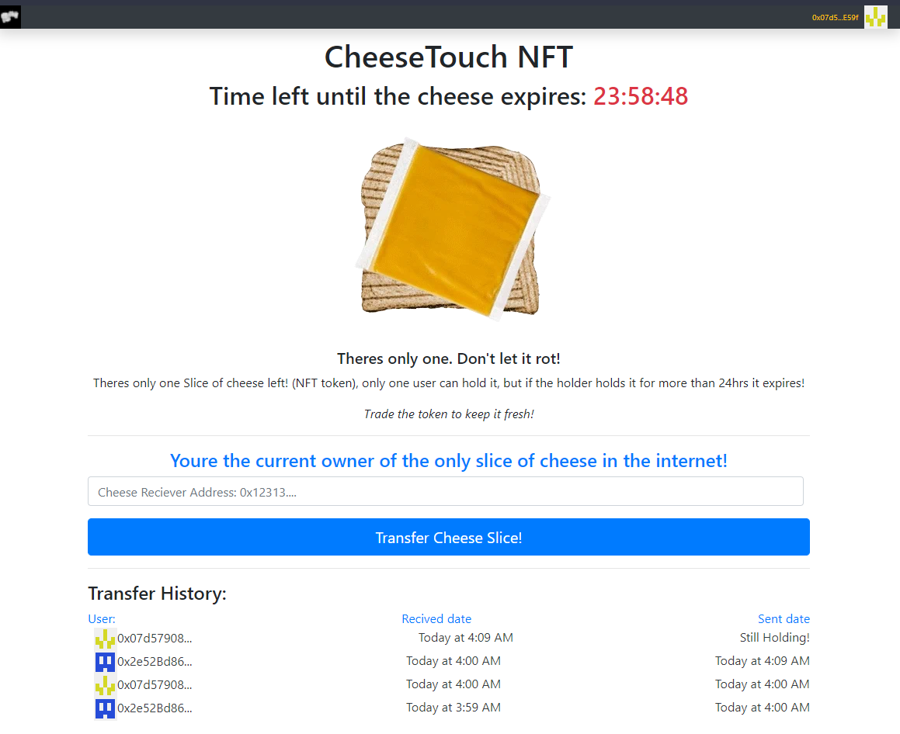

# CheeseTouch (CHT) NFT
A non-fungible token dapp for a token that no one wants to have, a cheese touch token. Only 1 token will be 'live' at a time. If there is no live token anyone can create one. Users are allowed to transfer the live token to anyone else. If any user holds a live token for more than 24 hours then they can no longer transfer it, and the token should no longer be live.

Meant to learn blockchain technologies, made with Solidity, truffle, ganache, Web3.js, React.js and contracts from openzeppelin such as ERC721Full and the library SafeMath.

## How to run.

1) Install the following dependencies: Node, truffle, ganache.
2) Make sure your `truffle-config.js` is setted up with your Ganache network.
3) Execute the command: `npm i`
4) Execute the command: `truffle migrate --reset`
5) Execute the command: `npm start`

## Testing.

- Execute the command `truffle test` to run the tests.
